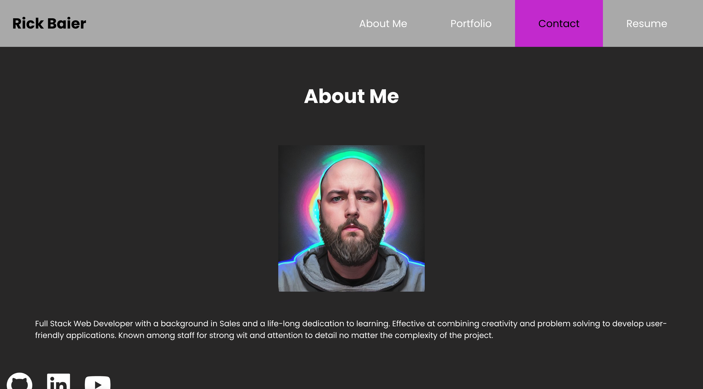

  # React Portfolio
  ## Description
  This is my professional portfolio built using React.
  ## Deployed Page
https://richardbaier.github.io/original-portfolio/
  ## Screenshot

  ## Table of Contents
- [React Portfolio](#react-portfolio)
  - [Description](#description)
  - [Deployed Page](#deployed-page)
  - [Screenshot](#screenshot)
  - [Table of Contents](#table-of-contents)
  - [Questions](#questions)
  
You can copy, modify, distribute and perform the work, even for commercial purposes, all without asking permission. See Other Information below.  
  
  ## Questions  
  If you have any further questions you may contact me at:  
  GitHub: [My GitHub](https://github.com/RichardBaier)  
  Email: bearbaier@gmail.com
